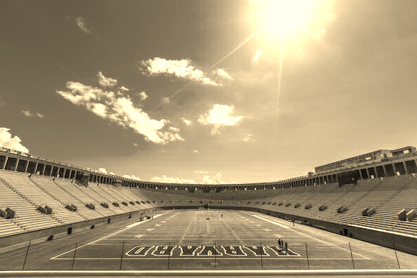
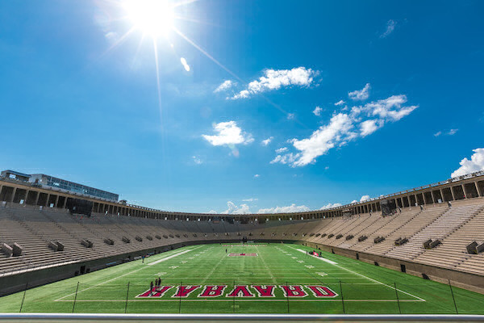

# Filter
## Description
This program is able to 'filter' images, by changing RBG (Red, Blue, Green) data in file images and using an algorithm to essentially recolor the image as a filter. There are five types of filters that the program is able to run. Grayscale, to turn images black and white. Sepia, to turn images like old photos yellowish color. Rotate, to rotate the image horizontally. Blur, to blur the image. And lastly, Edges to identify the edge in the picture. 

## Requirement
1. Images file are 24-bit uncompressed BMP 4.0 file
2. Only using the provided filter keys 

## How to running the program
1. First, compile the filter.c into filter
```
make filter
```
2. To run the filter, use this command in the terminal
```
./filter -[filter code] inputfile.bmp outputfile.bmp
```
Example : (Turning stadium.bmp file into grayscale)
```
./filter -g Filter/images/stadium.bmp Filter/graystadium.bmp
```
3. Filter code : 
- g = grayscale
- s = sepia
- b = blur
- r = rotate
- e = edges
4. Output
### Original Photo

### Grayscale

### Grayscale

### Grayscale

### Grayscale

### Grayscale
