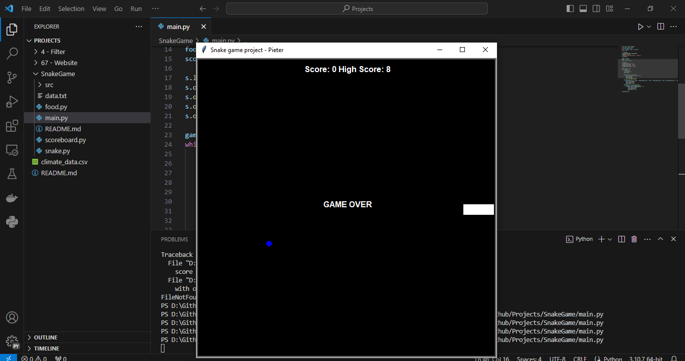
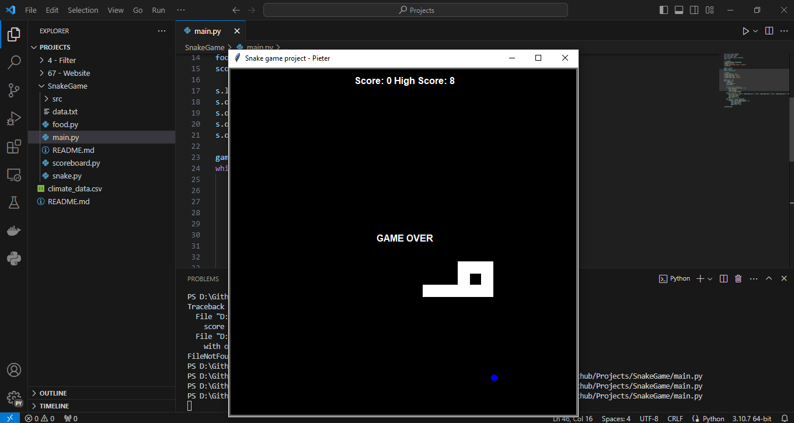
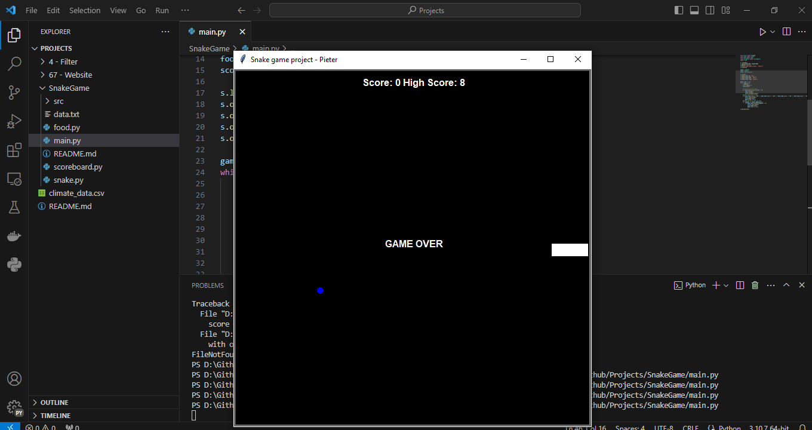
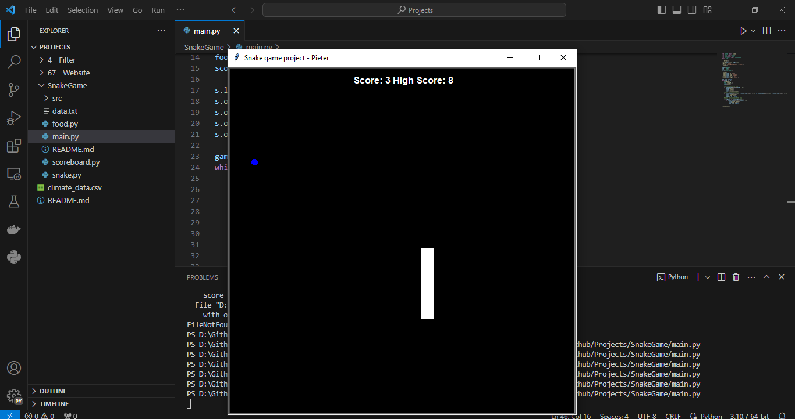

# Snake Game
## Deskripsi
This project means to recreate the classic snake game. The player can control the "snake" that automates going around the screen and eating the blue dot as food to grow. There is also a score and high score counter going to track your score. The player can use the 'up' key, 'down' key, 'left' key, and 'right' key to move the head of the snake. If the snake hits his tail or hits a wall, the game is over and the program tracks this game score and the highest score.

## How to running the program
1. First, run the main.py program
```
python .\SnakeGame\main.py
```
2. The screen will appear, there black screen with one snake that moves toward the right, a blue dot to assemble food, and a scoreboard. 

3. Move the snake using the 'up' key, 'down' key, 'left' key, or 'right' key. 
4. If the snake hits the food, it going to add the snake length one block

5. If the snake hits tail, the game is over

6. If the snake hit the wall, the game is over

7. To play it again, run the main.py again